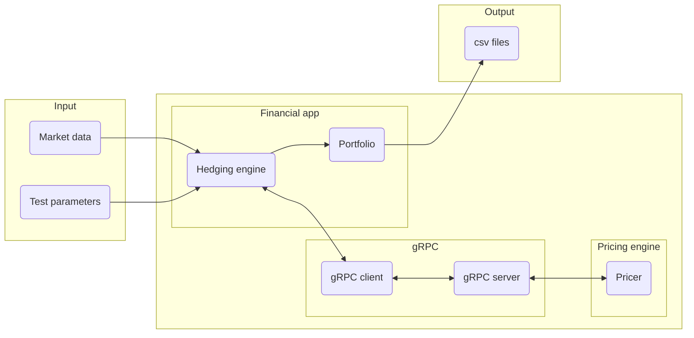

# Projet de couverture de produits multi-flux

## Présentation

L'objectif de ce projet est d'implémenter une application permettant de couvrir des produits dérivés dans un cadre plus général que celui du Projet de Couverture de Produits Dérivés: l'application développée permettra de couvrir des produits dérivés basés sur un calendrier réel, et versant plusieurs flux.

La réalisation de ce projet permettra à chaque élève:

- De comprendre de quelle façon peut être couvert un produit dérivé multiflux.
- D'implémenter de bout en bout une application composée de deux parties:
  - Une application *financière* à laquelle sont fournies les données financières, qui gère les dates de constatation et constitue le portefeuille de couverture. Cette application prendra 3 arguments dans cet ordre
    1. le fichier de description des paramètres financiers (`test-param.json`)
    2. le fichier de données de marché (`MarketData.csv`)
    3. le fichier contenant le portefeuille de couverture en sortie (`portfolio.json`)
  - Une application *mathématique*  dont le rôle est de calculer les quantités de sous-jacent à détenir dans le portefeuille de couverture. Cette application prendra comme unique argument le fichier des paramètres mathématiques (`math-param.json`)

## Payoff

 On considère un entier $`n\in \mathbb{N}`$ et on pose

 ```math
 \begin{align*}
 S &= (S_1, \ldots, S_n)\\
\mathcal{T} &= (t_1,\ldots, t_n)\\
\mathcal{K} &= (K_1,\ldots, K_n)\\
C_0 & = \Omega\\
C_i & = C_{i-1} \cap \left\{S_i(t_i) \leq K_i\right\}\\
P_i & = \left(S_i(t_i) - K_i\right)_+\cdot\mathbb{1}_{C_{i-1}}
 \end{align*}
 ```

 Le produit dérivé verse le flux
 $`P = \sum_{i=1}^n P_i`$, autrement dit, il verse le flux $`P_i`$ à la date $`t_i`$.

## Organisation, contraintes techniques

- Le projet devra être réalisé en binômes.
- L'application financière devra être codée en C# (.NET 6). Il s'agira d'une application console qui prend en entrée une configuration de produit et des données de marché, et fournit en sortie un fichier json qui contient les résultats.
- Le coeur de calcul devra être codé en C++.
- La communication entre l'application financière et le coeur de calcul se fera à l'aide d'un client et d'un serveur gRPC.



## Etapes principales du projet

- Faire valider l'architecture et le principe mathématique de couverture
- Réussir à faire communiquer le client et le serveur grpc (squelettes)
- Implémentation d'un outil qui couvre un call vanille
- Implémentation d'un outil qui couvre un call avec barrière discrète
- Implémentation d'un outil qui couvre un produit versant $`2`$ flux
- Implémentation d'un outil qui couvre un produit versant $`n>2`$ flux

## Moteur de calcul

Le moteur de calcul codé en C++ utilisera les outils/libraires suivantes

- `CMake`
- Une version récente de `g++` ou `clang++`.
- [PNL](https://pnlnum.github.io/pnl) : installer la dernière version à partir de https://github.com/pnlnum/pnl/releases. Sous Ubuntu, il faut préalablement installer `libblas-dev`, `liblapack-dev` et `gfortran`.
- Une libraire de manipulation de fichiers `.json` en C++ : [nlohmann_json](https://github.com/nlohmann/). Cette librairie est disponible dans la plupart des gestionnaires de paquets
  - Homebrew : `brew install nlohmann-json`
  - Ubuntu : installer `nlohmann-json3-dev`.

  Voir un exemple d'utilisation dans [`PricerEngine/test_json_reader.cpp`](PricerEngine/test_json_reader.cpp).
- Installer `grpc` et `protobuf`
  - Homebrew : `brew install grpc`
  - Ubuntu : installer le paquet `protobuf-compiler`. Le paquet `libgrpc++-dev` ne contient pas les fichiers permettant la détection de `grpc` par `CMake`. vous devez donc installer `grpc` depuis https://github.com/grpc/grpc.

### Lancement sous Windows

- **Prérequis**: avoir installé CMake (de préférence Cmake gui) et git sur la machine.
- Télécharger et installer *vcpkg* depuis github en suivant les [instructions fournies](https://github.com/microsoft/vcpkg#quick-start-windows).
- Se servir de *vcpkg* pour installer Protobuf, gRPC et nlohmann-json en version 64 bits:
  - .\vcpkg.exe install protobuf:x64-windows
  - .\vcpkg.exe install grpc:x64-windows
  - .\vcpkg.exe install nlohmann-json:x64-windows
 Dans Cmake-gui, ajouter les deux entrées suivantes:
  - CMAKE_PREFIX_PATH: chemin vers le dossier de libpnl qui contient les répertoires *lib* et *include*
  - CMAKE_TOOLCHAIN_FILE: chemin vers le fichier *[racine vcpkg]/scripts/buildsystems/vcpkg.cmake*


### FAQ

- **SSL is not found on OSX** :
  - Installer `pkg-config`: `brew install pkg-config``
  - Exécuter `export PKG_CONFIG_PATH="$(brew --prefix)/opt/openssl@1.1/lib/pkgconfig"` ou lancer `cmake` avec la commande `PKG_CONFIG_PATH="$(brew --prefix)/opt/openssl@1.1/lib/pkgconfig" cmake`.
- **Intellisense does not find `pricing.grpc.pb.h`** : ajouter le répertoire de `build` à la liste des répertoires utilisés par intellisense. Sous VS Code, ajouter `${workspaceFolder}/PricerEngine/build` à `includePath`.
- **Erreur de compilation à cause de *Status::OK*:** ceci est dû à un conflit dans les noms de constantes. Utiliser une version de PNL `>=1.11.0`.
- **Ubuntu: `cmake` ne trouve pas`gRPCConfig.cmake`** : https://bugs.launchpad.net/ubuntu/+source/grpc/+bug/1935709. Il faut utiliser la version source de `grpc`: https://github.com/grpc/grpc.
- **Nuget ne trouve pas le package alors que la source est disponible**: Nuget peut arrêter son exécution et indiquer ne pas avoir trouvé un package une source de package est erronée (par exemple quand un chemin vers un fichier est spécifié dans les sources, au lieu d'un chemin vers un répertoire). Les sources de package peuvent être inspectées depuis Visual Studio (Windows), ou bien via la commande `dotnet nuget list source`. Si une source est erronée, elle peut être supprimée à l'aide de la commande `dotnet nuget remove source [nom de la source]`. **Attention:** il faut spécifier le *nom* de la source, et pas son chemin dans la commande précédente.
- **Erreur de compilation gRPC après un merge**: il est possible qu'il y ait des différences d'encodage du fichier Protobuf (*pricing.proto* ici). Ceci peut être détecté dans la fenêtre *Sortie* à la compilation. Il faut alors récupérer une nouvelle version du fichier pour rétablir un encodage qui convient.
- ** Erreurs de parsing du JSon avec *nlohmann* à l'exécution de *pricing_server*:
    - S'assurer que le chemin vers le fichier JSon est un chemin absolu
    - S'assurer que le fichier JSon est encodé en UTF-8 
- **Comment créer un Client .NET invoquant un serveur via *http* au lieu de *https***: configurer le client (*GrpcPricer.GrpcPricerClient* dans le code ci-dessous)   de la façon suivante:

  ```csharp
  var httpHandler = new HttpClientHandler();
  // Return `true` to allow certificates that are untrusted/invalid
  httpHandler.ServerCertificateCustomValidationCallback =
      HttpClientHandler.DangerousAcceptAnyServerCertificateValidator;
  using var channel = GrpcChannel.ForAddress("http://localhost:5079",
      new GrpcChannelOptions { HttpHandler = httpHandler });
  var client = new GrpcPricer.GrpcPricerClient(channel);
   ```

- **Comment inspecter le contenu d'un `PnlVect` ou `PnlMat` depuis la fenêtre espion (*Watch*) de Visual Studio** ou **Visual Studio Code**:
  - Pour lire le contenu de l'emplacement `i` d'un `PnlVect* my_vect`, utiliser `my_vect->array[i]`.
  - Pour lire l'intégralité d'un `PnlVec* my_vect` taille `n`, utiliser l'une des syntaxes `*(double(*)[n])my_vect->array`, `*(my_vect->array)@n`, `(my_vect->array),n`
  - Pour lire l'intégralité de la ligne `i` d'une matrice `PnlMat *my_mat` de taille `m x n`, utiliser `*(double(*)[n])(my_mat->array + i * n`, `*(my_mat->array + i * n)@n`, `(my_mat->array + i * n),n`.
  - Voir la discussion https://github.com/Microsoft/vscode-cpptools/issues/172 pour plus d'information.

## Package Nuget *MultiCashFlow.Common* et sa documentation

Le package est disponible à cette adresse:

- [version 1.0.1.1](https://www.dropbox.com/scl/fi/vfc0r9qfs0opad5f1azol/MultiCashFlow.Common.1.0.1.1.nupkg?rlkey=20nuhieotgm29wncuyv201io3&dl=0)

La documentation correspondante est disponible [ici](NugetDoc/index.md)

### Installation sous linux

- Mettre à jour les sources de packages pour inclure le dossier contenant le package *MultiCashFlow.Common* à l'aide de la commande *`dotnet nuget add source [chemin vers le dossier]`*
- Installer le package dans le projet voulu à l'aide de la commande *`dotnet add [NomProjet.csproj] package MultiCashFlow.Common`*

## Autres ressources

- Présentation des principes [SOLID](https://www.dropbox.com/scl/fi/k848zepp2hmfw9sxbr1mg/PresentationSolid.pdf?rlkey=nrex5ernp6n0f2gkxfbkherue&dl=0)
- [Code source](barrier-option-pricing) du pricer d'options barrières 

## Modalités de rendu

**Date de rendu** : 20/01/2023 à 12h

**Site de dépôt** : https://filesender.renater.fr/?s=upload&vid=4049f38c-5551-46fb-9fd3-7af459cda89c


Vous devez rendre une archive `Equipe_i.zip` où `i` correspond au numéro de l'équipe (voir https://gricad-gitlab.univ-grenoble-alpes.fr/jlensimag/3aif/-/issues/2). Cette archive créera à l'extraction l'arborescence suivante

```
Equipe_i/
    |- src
    |- AUTHORS
    |– output/
        |- portfolio1.json
        |- portfolio2.json
        |- ...
```

où

- `src` contient l'ensemble du code source (tous les projets `C++` ou `C#`)
- `AUTHORS` est un fichier texte contenant les prénoms, noms et mail grenoble-inp de chaque membre de l'équipe.
- `output` contient les fichiers `portfolio1.json`, `portfolio2.json`,... qui contiennent chacun la chaîne de caractères json qui aura été générée par le package `Nuget`.
